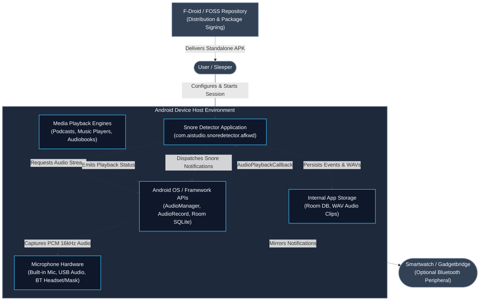
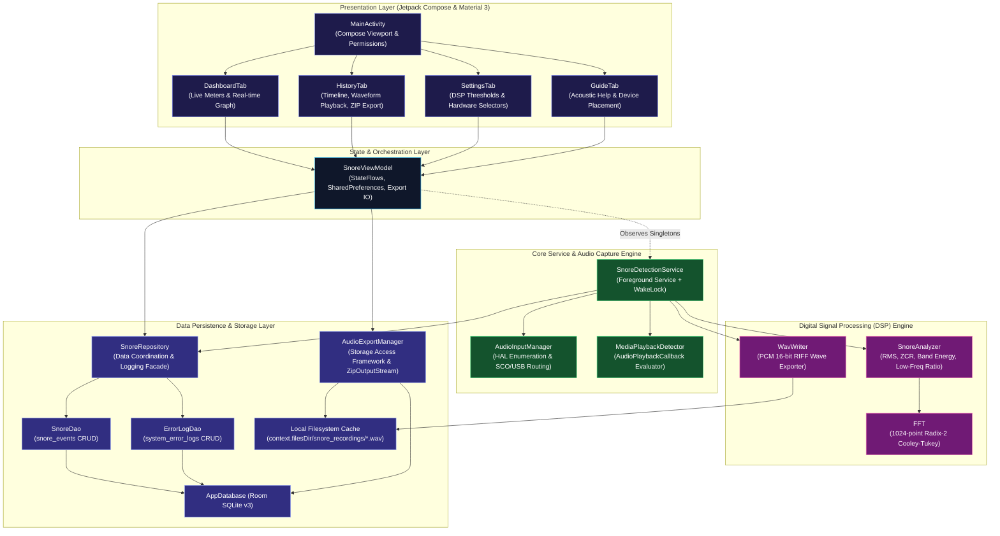
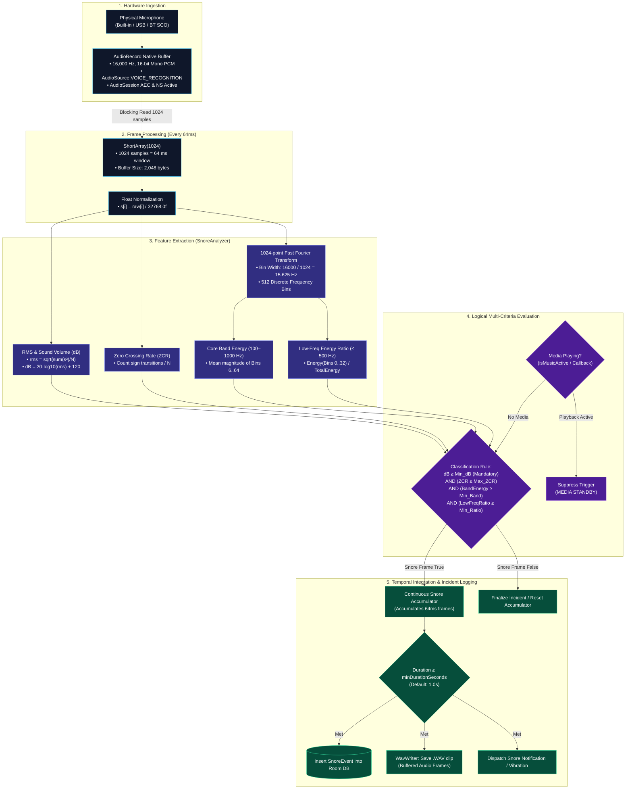
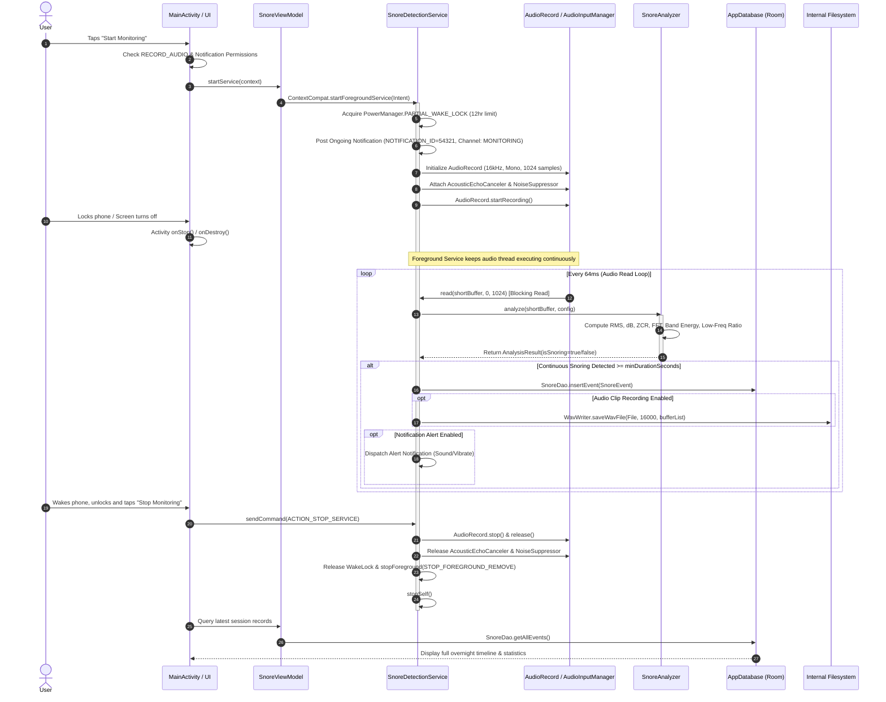
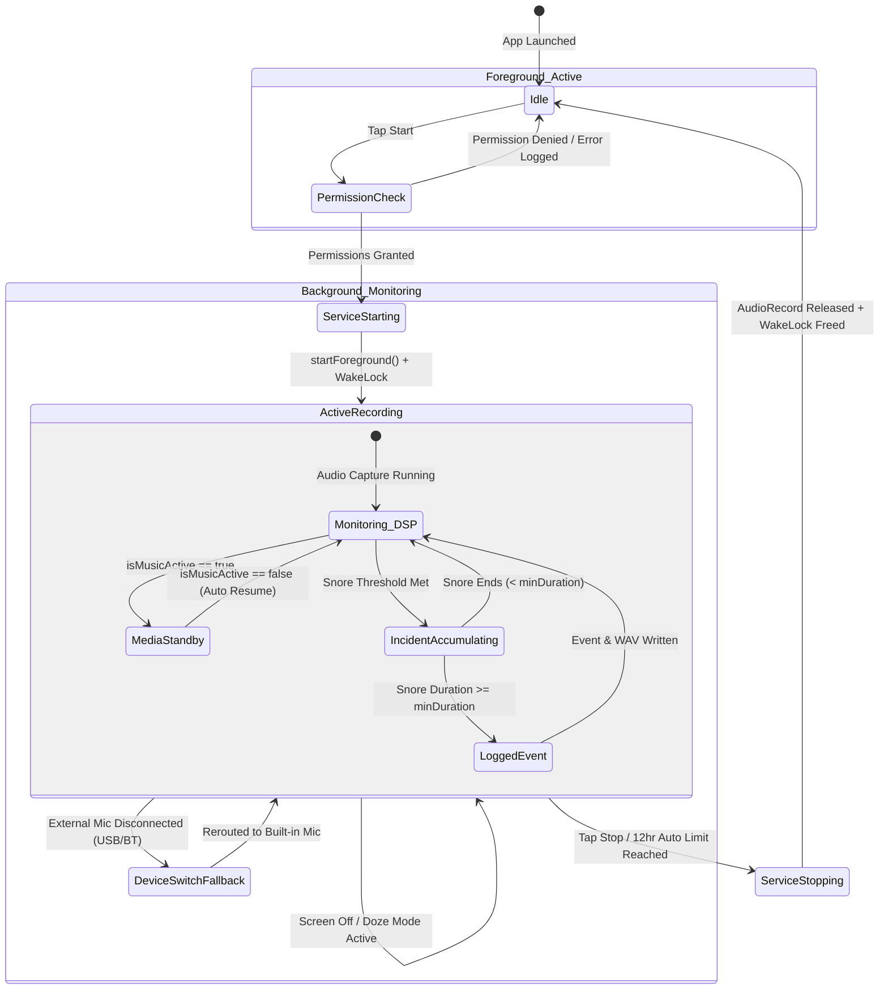
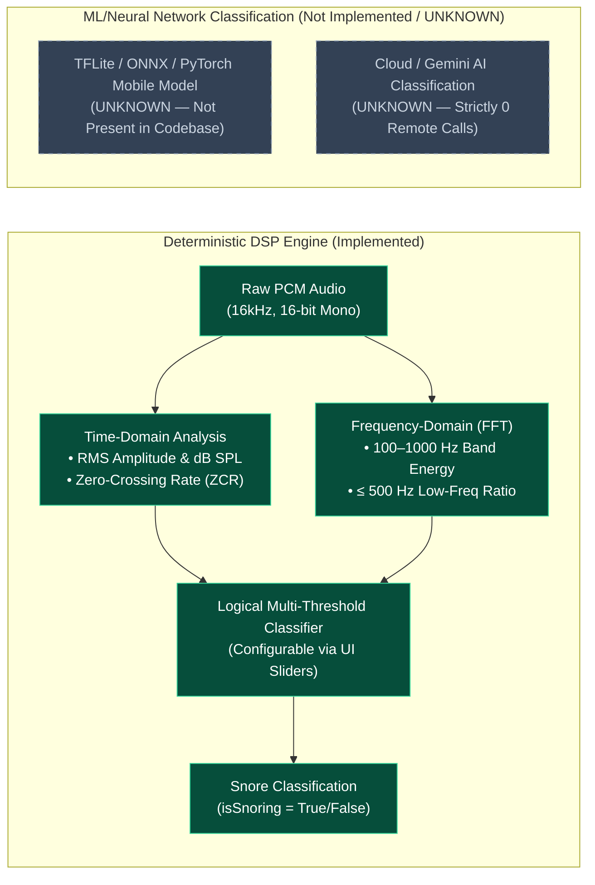
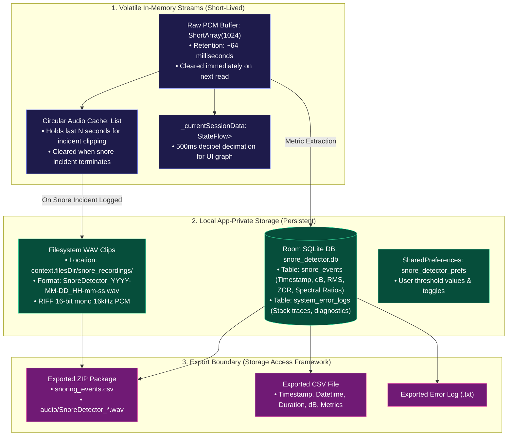
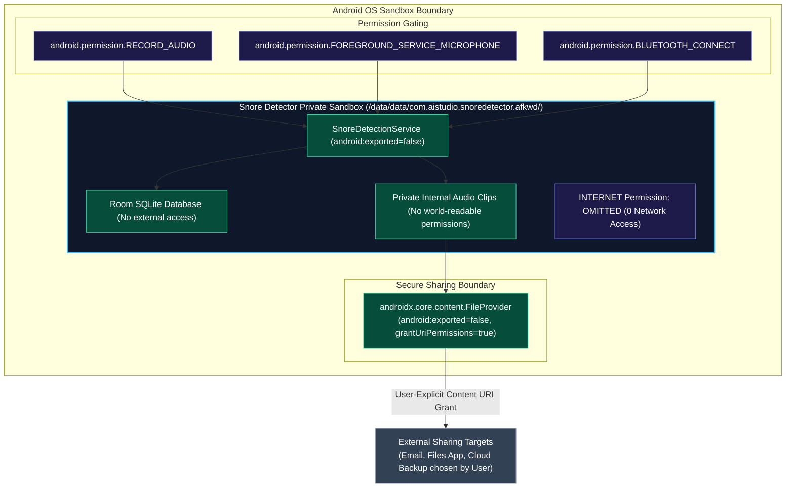
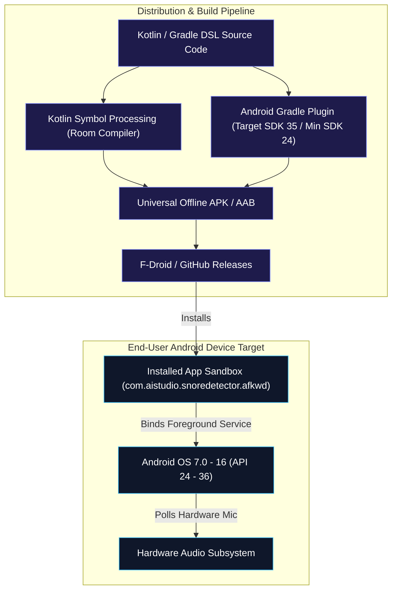
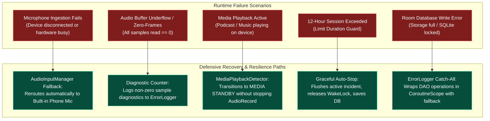

# System & Software Architecture Documentation (arc42 Aligned)

**Application:** Snore Detector for Android (FOSS / F-Droid Distribution)  
**Package:** `com.aistudio.snoredetector.afkwd`  
**Target Platform:** Android 7.0 (API Level 24) through Android 15 / 16 (API Level 36)

---

## 1. System Context

The application runs entirely on-device in a sandboxed, zero-telemetry environment. It interfaces directly with Android HAL audio endpoints (Internal Microphones, USB Audio interfaces, Bluetooth SCO/BLE peripherals) to capture, evaluate, and store acoustic sleep data.

### System Context Diagram

**Context Characteristics:**
- **No Remote Backend / Cloud**: There is **no cloud server, analytics ingestion endpoint, or remote AI API**.
- **No Third-Party Tracker SDKs**: Relies strictly on standard Android Open Source Project (AOSP) APIs and Jetpack libraries.
- **Companion Notification Forwarding**: Compatible with Gadgetbridge for vibration feedback on connected smartwatches without proprietary companion apps.

---

## 2. Application Building Blocks (Decomposition View)

The application adheres to modern Android Architecture (MVVM + Foreground Service + Unidirectional Data Flow).

### Component Responsibilities & Interfaces

| Component | Technology | Primary Responsibility | Important Interfaces |
| :--- | :--- | :--- | :--- |
| **`MainActivity`** | Compose / AndroidX | Single-activity container, dynamic permission orchestrator (`RECORD_AUDIO`, `POST_NOTIFICATIONS`, `BLUETOOTH_CONNECT`). | Compose UI hierarchy, `ActivityResultContracts` |
| **`SnoreViewModel`** | ViewModel / Coroutines | Exposes UI state, manages `SharedPreferences` persistence for DSP sliders, coordinates SAF export intents. | `StateFlow`, `viewModelScope`, `SnoreRepository` |
| **`SnoreDetectionService`** | Foreground Service | Maintains `AudioRecord` read loop, orchestrates WakeLock, controls notification channel, integrates DSP results. | `AudioRecord.read()`, `NotificationManager` |
| **`AudioInputManager`** | Android HAL API | Probes physical microphone endpoints, initiates Bluetooth SCO / `setCommunicationDevice`, handles fallback to built-in mic. | `AudioManager.getDevices()`, `AudioDeviceInfo` |
| **`MediaPlaybackDetector`**| Android Audio API | Identifies active music/podcast playback on `STREAM_MUSIC` to suspend triggers during sleep-listening. | `AudioPlaybackCallback`, `isMusicActive()` |
| **`SnoreAnalyzer`** | Pure Kotlin DSP | Performs frame-by-frame 1024-point time-domain and frequency-domain metric extraction and threshold evaluation. | `analyze(shortSamples, config): AnalysisResult` |
| **`FFT`** | In-place Algorithm | Cooley-Tukey Radix-2 Fast Fourier Transform computing discrete frequency magnitudes across 512 frequency bins. | `fft(real[], imag[])` |
| **`WavWriter`** | Java I/O | Encodes 16-bit 16kHz PCM frames into RIFF/WAVE header and data chunks. | `saveWavFile(File, sampleRate, List<ShortArray>)` |
| **`AppDatabase` / `SnoreDao`** | Room / SQLite v3 | Local offline database storing individual snore events with full acoustic metrics and diagnostic error logs. | Room `@Dao`, `Flow<List<SnoreEvent>>` |
| **`AudioExportManager`**| Java Zip / SAF | Streams database records and audio files into standardized ZIP and CSV formats via `DocumentUri`. | `ZipOutputStream`, `FileProvider` |

---

## 3. Audio & Signal Processing Pipeline

The detection pipeline processes raw audio in discrete non-overlapping frames of 1024 samples (64ms at 16kHz).

### Acoustic Pipeline Technical Specifications

| Parameter | Value / Implementation | Architectural Justification |
| :--- | :--- | :--- |
| **Sampling Rate** | 16,000 Hz (16 kHz) | Nyquist frequency is 8 kHz; human snoring spectra are predominantly concentrated below 1.5 kHz. Minimizes CPU and battery usage. |
| **Channel Config** | `AudioFormat.CHANNEL_IN_MONO` | Single channel reduces buffer sizes and memory bandwidth by 50% compared to stereo. |
| **Audio Format** | `AudioFormat.ENCODING_PCM_16BIT` | Standard uncompressed linear PCM supported across 100% of Android devices. |
| **Frame / Window Size** | 1024 samples (64.0 milliseconds) | Power-of-two window size required for radix-2 Cooley-Tukey FFT. |
| **Spectral Resolution** | 15.625 Hz per FFT bin ($16000 / 1024$) | Enables precise bin-level isolation for the 100–1000 Hz band (Bins 6–64) and ≤500 Hz low-band (Bins 0–32). |
| **Acoustic Preprocessing**| `AudioSource.VOICE_RECOGNITION` + `AcousticEchoCanceler` + `NoiseSuppressor` | Strips speaker feedback loop and ambient background hiss while retaining snore transients. |
| **Latency per Frame** | ~64 ms read interval + <1 ms compute | Real-time classification on low-end ARM cores without buffer underrun or audio frame drops. |

---

## 4. Overnight Recording Runtime Sequence

This sequence illustrates the primary use-case: continuous overnight monitoring across app backgrounding, lock-screen transitions, snore detection, and final export.

---

## 5. Android Lifecycle & Background Execution Architecture

### Background Execution Guarantee Mechanics

1. **Foreground Service Declaration**:
   Declared with `android:foregroundServiceType="microphone"`. Binds directly to a persistent system status-bar notification, preventing Android OS low-memory killer (LMK) eviction.
2. **Partial WakeLock Management**:
   `PowerManager.WakeLock` (`PowerManager.PARTIAL_WAKE_LOCK`, tag: `SnoreDetector:WakeLock`) is acquired at session launch with an absolute safety timeout of 12 hours (`12 * 60 * 60 * 1000L`). This prevents CPU sleep when the screen turns off.
3. **Hardware Routing Resiliency**:
   If a Bluetooth headset or USB adapter disconnects during the night, `AudioInputManager` traps the routing change and falls back to `TYPE_BUILTIN_MIC` without terminating the foreground service.

---

## 6. Machine Learning Architecture Assessment

### Architectural Confirmation
- **Status in Source Code:** **NO MACHINE LEARNING MODEL PRESENT**.
- **Underlying Engine:** Pure deterministic on-device **Digital Signal Processing (DSP)**.

**Architectural Rationale for DSP over ML:**
- **Zero Ingestion Latency & Predictability**: DSP operates with sub-millisecond execution times without matrix tensor allocations.
- **Battery Conservation**: An all-night (8–10 hour) neural network inference loop on mobile hardware causes battery drain and thermal throttling; standard FFT + ZCR consumes minimal CPU resources.
- **Transparency & User Control**: Users can adjust individual physical acoustic parameters (RMS dB threshold, ZCR rumble cap, frequency ratios) rather than treating detection as an opaque black box.

---

## 7. Data Architecture & Lifecycle

### Data Element Lifecycle Matrix

| Data Item | Storage Location | Retention Policy | Leaves Device? |
| :--- | :--- | :--- | :--- |
| **Raw PCM Frame (64ms)** | In-Memory (`ShortArray`) | **Volatile**: Overwritten every ~64ms. | **Never** |
| **Live Timeline Decibels**| StateFlow (`List<AmplitudePoint>`) | **Session Scope**: Cleared when a new recording starts. | **Never** |
| **Snore Incidents (Metrics)**| SQLite (`snore_events` table) | **Persistent**: Retained until user deletes manually or clears app data. | **Only via User-Initiated SAF Export** |
| **Audio Incident Clips (.wav)**| App Internal Storage (`filesDir/snore_recordings/`)| **Persistent**: Retained until user deletes records or toggles saving off. | **Only via User-Initiated SAF / Share Intent** |
| **System Error Logs** | SQLite (`system_error_logs` table) | **Persistent**: Anonymized local logs for on-device diagnostics. | **Only via User-Initiated Share/Export** |
| **DSP Preferences** | `SharedPreferences` | **Persistent**: Maintained across app updates. | **Never** |

---

## 8. Privacy & Security Architecture

### Security & Privacy Verifications
- **Complete Air-Gap Isolation**: The `android.permission.INTERNET` permission is **explicitly omitted from `AndroidManifest.xml`**. The app cannot transmit data to the network.
- **Service Isolation**: `SnoreDetectionService` is configured with `android:exported="false"`, preventing other applications from binding to or hijacking the audio recording pipeline.
- **Sandboxed Storage**: All SQLite data and `.wav` audio snippets are stored in internal private app storage (`context.filesDir`), inaccessible to non-root applications.
- **Export via Content URIs**: Shared audio files use standard Android `FileProvider` with temporary single-target URI grants (`FLAG_GRANT_READ_URI_PERMISSION`).

---

## 9. Deployment Architecture

---

## 10. Failure, Resource, & Degradation Architecture

---

## 11. Comprehensive arc42 Architectural Assessment

### 1. Introduction and Goals
- **Documented from Source:** The system is an on-device Android application designed to capture, classify, log, and export nocturnal snoring events using real-time DSP.
- **Primary Goals:** Low power consumption during 8–12 hour monitoring sessions, zero cloud dependencies, complete privacy, audio hardware versatility (Built-in, USB, Bluetooth SCO), and clean export capabilities (ZIP/CSV).

### 2. Constraints
- **Technical Constraints:** Android API 24+ (Android 7.0 Nougat and newer).
- **Distribution Constraints:** Distributed through F-Droid and FOSS channels; must not depend on proprietary Google Play Services APIs or closed-source tracking binaries.
- **Hardware Constraints:** Must operate across low-end mobile CPUs without thermal throttling during overnight sleep cycles.

### 3. Context and Scope
- **Scope:** Pure on-device acoustic analysis. No external cloud servers or user accounts. Audio ingestion is strictly local from the phone’s microphone subsystem.

### 4. Solution Strategy
- **MVVM Architecture:** Jetpack Compose for declarative UI, `SnoreViewModel` for UI state representation, `SnoreRepository` for Room database coordination.
- **Decoupled Background Execution:** Dedicated `SnoreDetectionService` (Foreground Service with `PARTIAL_WAKE_LOCK`) maintains continuous audio capture and DSP independent of UI lifecycle state.
- **Deterministic DSP Classification:** Radix-2 FFT and multi-feature evaluation (RMS dB, ZCR, Band Energy, Low Frequency Spectral Ratio) replace heavy machine learning inference models.

### 5. Building Block View
- **Presentation:** Compose UI (`MainActivity`, `DashboardTab`, `HistoryTab`, `SettingsTab`, `GuideTab`).
- **Orchestration:** `SnoreViewModel`, `AudioInputManager`, `MediaPlaybackDetector`.
- **Processing:** `SnoreAnalyzer`, `FFT`, `WavWriter`.
- **Persistence:** `AppDatabase`, `SnoreDao`, `ErrorLogDao`, `AudioExportManager`.

### 6. Runtime View
- **Lifecycle Guarantees:** Continuous overnight recording backed by foreground notification and 12-hour WakeLock safety limit.
- **Coexistence Pipeline:** `MediaPlaybackDetector` registers system audio playback callbacks to suspend snoring evaluation while podcasts or music play, automatically resuming when media stops.

### 7. Deployment View
- Single-module APK (`app`) compiled with Kotlin DSL, Android Gradle Plugin, and KSP for Room SQLite metadata generation.

### 8. Crosscutting Concepts
- **Error Handling & Diagnostics:** `ErrorLogger` provides a unified diagnostic catch-all mechanism logging device specifications, OS build info, and stack traces to a dedicated SQLite table (`system_error_logs`).
- **Theming & Design:** Material Design 3 dynamic color scheme supporting system-wide Light and Dark themes with edge-to-edge system bar insets.

### 9. Architecture Decisions Record (ADR Summary)
1. **Decision: Pure DSP vs. Machine Learning**
   - *Rationale:* Deterministic DSP (RMS dB + ZCR + FFT) uses less CPU/memory and avoids battery drain over 8–12 hours compared to continuous neural network inference, while giving users full transparency to tune thresholds.
2. **Decision: Complete Offline Isolation (No Internet Permission)**
   - *Rationale:* Total privacy for overnight bedroom audio recording; builds user trust for F-Droid distribution.
3. **Decision: Storage Access Framework (SAF) for Export**
   - *Rationale:* Eliminates risky `MANAGE_EXTERNAL_STORAGE` permissions while allowing export to user-selected locations.

### 10. Quality Requirements Evaluation
- **Battery & CPU Efficiency:** 16kHz mono sampling and 64ms frame processing keep CPU utilization minimal on modern ARM architectures.
- **Reliability:** Audio routing automatically falls back to built-in mic if external USB or Bluetooth peripherals disconnect overnight.
- **Testability:** Complete unit test suite (`MediaPlaybackDetectorTest`, `AudioInputManagerTest`, `SnoreDetectionLogicTest`, `AudioExportManagerTest`, Robolectric CUJ tests).

### 11. Risks and Technical Debt
- **Risk 1 (Device-Specific Battery Optimization):** Aggressive OEM battery killers (e.g., Xiaomi MIUI, Huawei EMUI, Samsung OneUI) may kill background processes despite the Foreground Service and WakeLock if the user does not disable battery optimization for the app.
- **Risk 2 (Microphone Gain Discrepancies):** Raw microphone input gain differs across phone hardware; relative dB calculation relies on uncalibrated Android microphone references unless tuned in settings.

### 12. Glossary of Terms
- **DSP:** Digital Signal Processing.
- **RMS (Root Mean Square):** Statistical measure of the magnitude of a varying audio signal.
- **ZCR (Zero-Crossing Rate):** The rate at which an audio signal changes from positive to zero to negative (useful for identifying low-pitch snoring rumble vs. high-frequency speech/hiss).
- **FFT (Fast Fourier Transform):** An efficient algorithm to compute the Discrete Fourier Transform (DFT), converting time-domain PCM samples into frequency-domain spectral magnitude bins.
- **SCO (Synchronous Connection-Oriented):** Bluetooth profile used for two-way voice communication and wireless microphone audio capture.
- **SAF (Storage Access Framework):** Android platform file access mechanism allowing users to save and load files without broad storage permissions.

